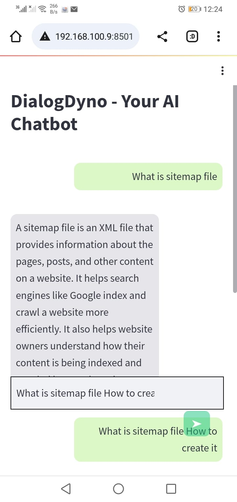
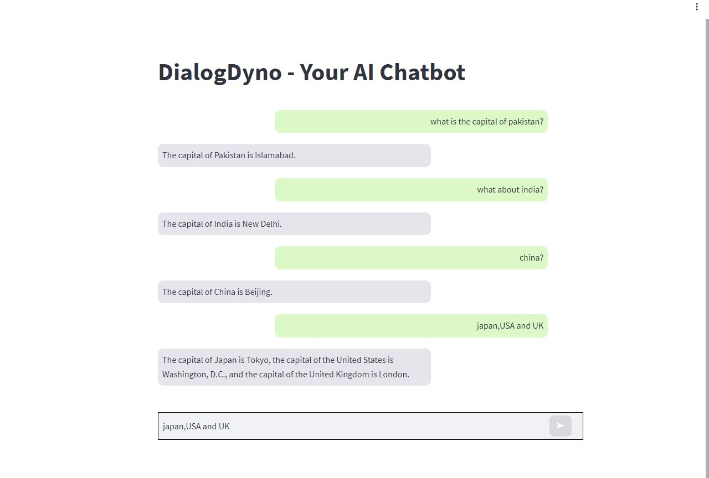

# DialogDyno - Your AI Chatbot


DialogDyno is a web application that uses AI to power a chatbot. It's built with Python and uses the Streamlit library for the web interface and the OpenAI API for generating chatbot responses.

## Features

- Interactive chat interface
- Customizable chatbot responses
- Responsive design for mobile and desktop

## Screenshots

### Mobile Interface



### Desktop Interface



## Installation

1. Clone this repository to your local machine using [https://github.com/Kaptan-Usama/chatbot](https://github.com/Kaptan-Usama/chatbot)
2. Navigate to the project directory.
3. Install the required packages using pip:
    ```
    pip install -r requirements.txt
    ```
4. Run the app:
    ```
    streamlit run chatbot.py
    ```

## Usage

1. Enter your OpenAI API Key in the sidebar.
2. Enter a prompt in the text input field.
3. Click the "➤" button to generate a response from the chatbot.


## License

Copyright (c) 2023 Muhammad Usama

Permission is granted to use, copy, modify, merge, publish, distribute, sublicense, and/or sell copies of this software. See the LICENSE file for more details.

